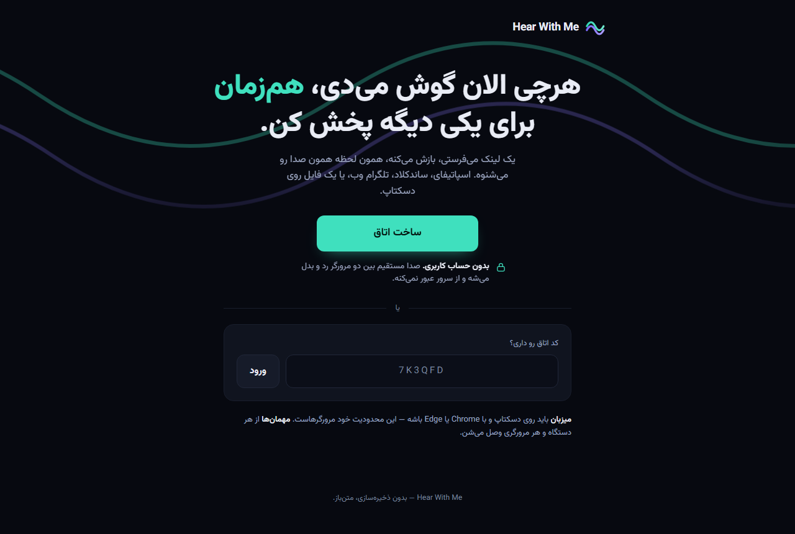
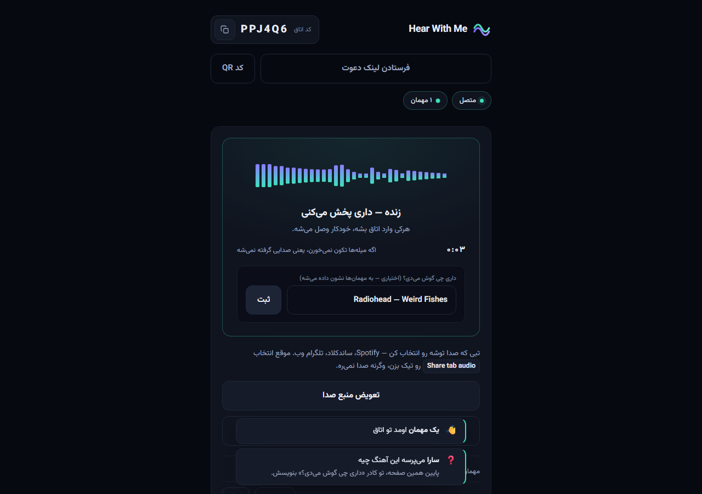
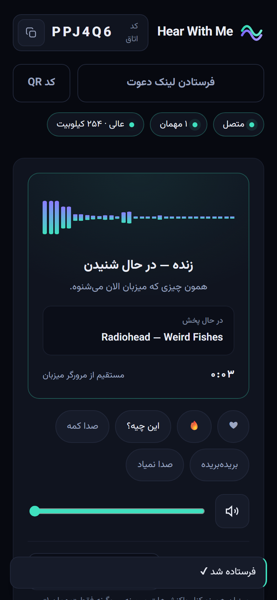

<div align="center">
  
  <h1>Hear With Me</h1>
  <p><strong>Send whatever is playing on your desktop, live, to anyone with a link.</strong></p>
  <p>
    <a href="README.fa.md">فارسی</a> ·
     ·
     ·
    
  </p>
</div>



## What this is

You are listening to something on your computer — a Spotify tab, SoundCloud,
a local file, a native app. You send one link. The other person opens it on
their phone and hears exactly what you hear, at the same moment.

**It is not a synced player and not a shared playlist.** Nobody picks a track.
The host's real audio output is captured and streamed peer-to-peer over WebRTC,
so whatever comes out of their speakers comes out of yours.

The audio never passes through the server. The server creates rooms and relays
signaling messages; that is all it can see.

<table>
<tr>
<td width="62%"></td>
<td></td>
</tr>
<tr>
<td align="center"><sub>Host — desktop</sub></td>
<td align="center"><sub>Guest — phone</sub></td>
</tr>
</table>

## Requirements

| | |
|---|---|
| **Host** (sends the audio) | Desktop **Chrome or Edge**. No mobile browser exposes tab or system audio capture — a browser limitation, not a missing feature. |
| **Guest** (listens) | Any device, any browser. Receiving a WebRTC stream is universally supported. |

## Run it

```bash
node server.js
```

Then open `http://localhost:3000`. There is nothing to install: no npm
dependencies at runtime and no build step.

To try it across two real devices, the server has to be reachable over
**HTTPS** — `getDisplayMedia` and `RTCPeerConnection` only work in a secure
context, and `localhost` is the single exception:

```bash
ssh -R 80:localhost:3000 nokey@localhost.run
```

> **Note:** Cloudflare quick tunnels (`trycloudflare.com`) do not work. They
> buffer the whole response body, and this app's signaling is Server-Sent
> Events, so the browser receives nothing and the room hangs on "connecting".

## What a room can do

**Host**

- Switch the captured tab mid-session — `replaceTrack`, so no guest drops out.
- Set the audio quality (256 / 128 / 64 kbps) for the whole room.
- Lock the room, remove a guest, or hand hosting to a specific guest.
- End the room on leaving, instead of promoting whoever joined first.
- Show a QR code — the host is on a desktop, the guest is holding a camera.

**Guest**

- React: ❤ / 🔥 / "what is this?" / "too quiet" / "breaking up" / "no sound".
  Cheers float over the stage; anything the host must act on stays put and says
  what to do about it.
- Pick a name, so the host sees who is who.
- Ask for a lower bitrate on mobile data — only that guest's stream narrows.
- Keep the screen awake, which removes the most common way playback dies on a
  phone.

**Both sides** see a level meter read from the audio's own spectrum — the one
indicator that can tell "connected" from "connected but silent" — and a
connection-quality reading taken from `getStats`.

## How it works

```
Audio source (anything)
        │
Platform capture          ← host's browser only: getDisplayMedia
        │
WebRTC (peer-to-peer)     ← the audio, directly between two browsers
        │
Room layer (this server)  ← signaling only; never sees audio
        │
Playback                  ← any browser, any device
```

The server does four things: it creates rooms, decides who the host is, relays
"sharing started/stopped", and passes WebRTC offers, answers and ICE candidates
between members.

That last channel can be either **Server-Sent Events** or a **WebSocket**: the
page carries a `transport` meta tag that the server fills in, and the client
speaks both. This server uses SSE, which is what a long-lived process does
best; an edge runtime that cannot hold a response open can serve the same
client and say `ws` instead.

```
server.js          wiring
lib/               config · room (a Room class) · rooms · routes · sse · http
public/app.js      client entry — roles and event routing, no logic
public/js/         host-session · guest-session · dom · api · roster · notices ·
                   audio-meter · audio-quality · connection-quality · wake-lock · …
public/shared/     reactions · room-code — one definition, used by both sides
```

## Configuration

| Variable | Default | What it does |
|---|---|---|
| `PORT` | `3000` | |
| `STUN_URL` | Google's public STUN | Comma-separated for several |
| `TURN_URL` · `TURN_USERNAME` · `TURN_PASSWORD` | — | Added to what clients receive |
| `MAX_ROOMS` | `500` | Concurrent rooms |
| `ROOMS_PER_IP` | `12` | Room creations per IP per 10 minutes |
| `DISCONNECT_GRACE_MS` | `10000` | How long a dropped connection keeps its place |

Clients fetch ICE configuration from `GET /api/ice` at startup, so adding a
TURN server is an environment variable and a restart — not a client change.

## Tests

```bash
npm test                                              # room layer + QR encoder
npm install --no-save playwright && npx playwright install chromium
npm run test:e2e                                      # real WebRTC, host + 2 guests
```

The end-to-end test drives a real host and two real guests with a fake audio
device: both get live audio, switching the source disturbs neither, one guest's
quality request narrows only their own stream, and the level meters actually
respond to sound.

## Limits worth knowing

- **A guest's phone stops playback when locked or backgrounded.** The OS
  classifies a real-time stream as a call, and a call is suspended when you
  leave the app. The screen wake lock covers the common case; nothing covers
  the rest. Returning to the tab reconnects automatically.
- **No TURN server by default.** A small share of restrictive networks will
  fail to connect until one is configured.
- **The room code is the only protection.** Locking and removing are social
  controls, not security. Fine for friends; do not post a room link publicly.
- **Nothing is stored.** Restarting the server clears every room.

## License

MIT
